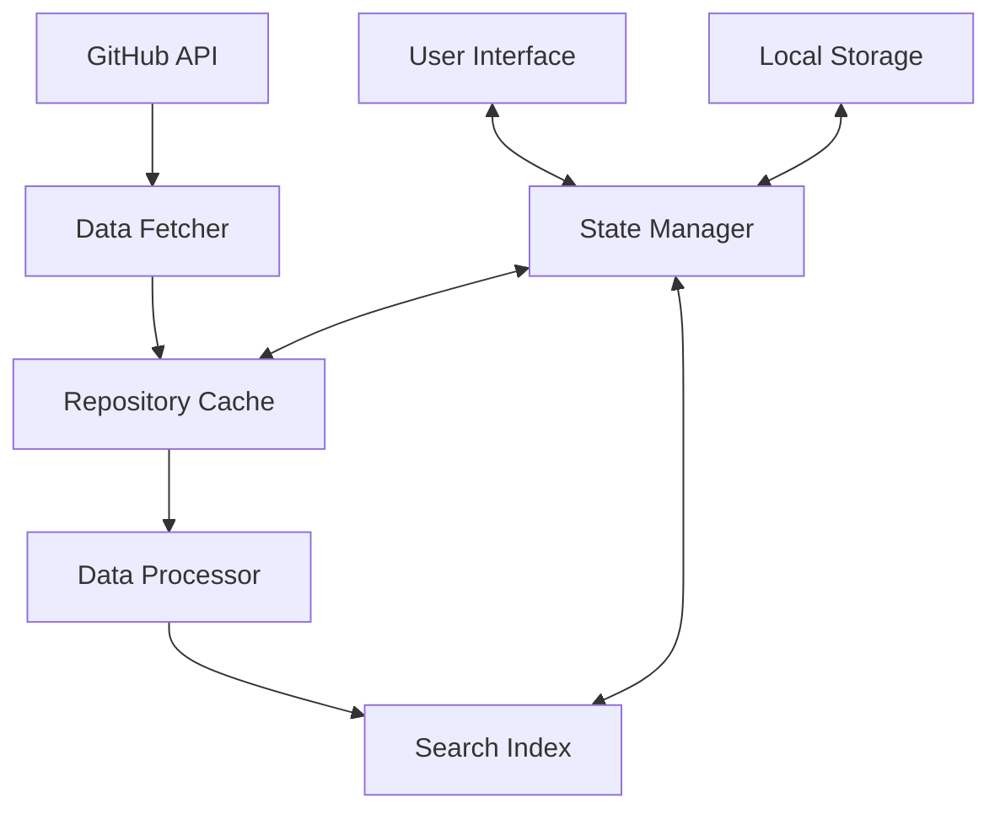

# Architecture

Browsealizer is built with a modern, scalable architecture designed to handle thousands of GitHub repositories while providing a smooth user experience. Here's a detailed look at how it works.

## System Architecture



### Core Components

#### Data Fetcher

The Data Fetcher module is responsible for communicating with the GitHub API:

- **Rate Limit Manager**: Ensures compliance with GitHub API limits
- **Authentication Handler**: Manages OAuth tokens for increased limits
- **Queue System**: Prioritizes and batches API requests
- **Retry Logic**: Handles failed requests with exponential backoff

#### Repository Cache

The Repository Cache stores fetched repository data for quick access:

- **IndexedDB Storage**: Client-side persistent storage
- **LRU Cache Policy**: Least Recently Used eviction for memory management
- **Versioning System**: Handles schema changes gracefully
- **Compression**: Minimizes storage footprint

#### Data Processor

The Data Processor enriches raw repository data:

- **Markdown Parser**: Extracts structured information from README files
- **Language Detector**: Identifies primary and secondary languages
- **Topic Analyzer**: Categorizes repositories by domain and purpose
- **Activity Scorer**: Rates repositories by community engagement

#### Search Index

The Search Index enables fast, client-side searching:

- **Inverted Index**: Maps terms to repositories for lightning-fast queries
- **Fuzzy Matching**: Tolerates typos and spelling variations
- **Relevance Scoring**: Ranks results by relevance to search terms
- **Filter System**: Narrows results by language, stars, activity, etc.

#### State Manager

The State Manager coordinates the application state:

- **Immutable State**: Prevents unexpected state mutations
- **Change Subscriptions**: Enables reactive UI updates
- **Action Dispatching**: Coordinates asynchronous operations
- **Persistence Layer**: Saves user preferences and history

## Front-End Architecture

Browsealizer's front-end is built with React and TypeScript:

### Component Structure

```
src/
├── components/
│   ├── core/         # Base UI elements
│   ├── layout/       # Structural components
│   ├── repository/   # Repository-specific components
│   └── search/       # Search interface components
├── hooks/            # Custom React hooks
├── services/         # API and data services
├── store/            # State management
└── utils/            # Helper functions
```

### Performance Optimizations

- **Virtualized Lists**: Render only visible repositories
- **Code Splitting**: Load components on demand
- **Memoization**: Prevent unnecessary re-renders
- **Web Workers**: Offload heavy processing to background threads
- **Service Worker**: Enable offline access to cached repositories

## Data Flow

1. User searches or scrolls to load more repositories
2. State Manager checks if data is in the Repository Cache
3. If not cached, Data Fetcher retrieves data from GitHub API
4. Data Processor enriches the repository information
5. Processed data is added to the Repository Cache and Search Index
6. UI components update to display the new repositories

## Technical Specifications

- **Front-End**: React 18, TypeScript, TailwindCSS
- **State Management**: Redux Toolkit
- **API Communication**: Axios, React Query
- **Storage**: IndexedDB, localStorage
- **Search**: FlexSearch.js
- **Mobile Optimization**: Responsive design, touch interactions