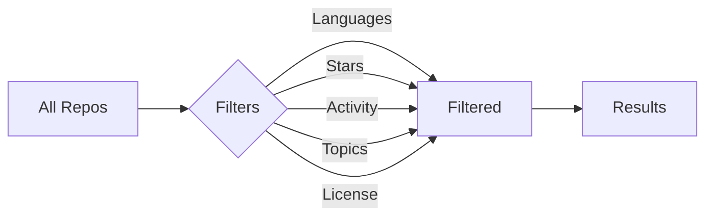

# Features

Browsealizer offers a rich set of features designed to enhance your GitHub exploration experience.

## Infinite Repository Feed

The cornerstone of Browsealizer is its endless, personalized feed of GitHub repositories:

- **Continuous Scrolling**: Load repositories seamlessly as you scroll
- **Smart Preloading**: Anticipates your browsing pattern to load content before you need it
- **Resumable Sessions**: Pick up exactly where you left off
- **Quick Preview**: Expand repository cards for more details without leaving the feed

## Advanced Filtering

Narrow down repositories with our comprehensive filtering system:

- **Language Filters**: Focus on repositories in specific programming languages
- **Star Range**: Filter by popularity (e.g., 100-1000 stars)
- **Activity Level**: Find recently updated or stable, mature projects
- **Topic Tags**: Browse by domain, framework, or purpose
- **License Type**: Filter by open source license compatibility
- **Creation Date**: Discover new projects or established codebases
- **Combination Filters**: Mix and match criteria for precise results

## Smart Search

Our powerful search goes beyond simple text matching:

- **Full-Text Search**: Search across repository names, descriptions, and READMEs
- **Code Snippets**: Find repositories containing specific code patterns
- **Semantic Search**: Find repositories by concept, not just keywords
- **Saved Searches**: Store complex search queries for later use
- **Search History**: Easily return to previous searches

## Repository Insights

Gain deeper understanding of repositories at a glance:

- **Code Quality Metrics**: Visualize test coverage, code complexity, and documentation quality
- **Contribution Graphs**: See contribution patterns over time
- **Dependency Analysis**: View direct and transitive dependencies
- **Release Timeline**: Track version history and update frequency
- **Issue Analytics**: Understand bug patterns and feature requests

## Personalization

Customize Browsealizer to match your preferences:

- **Interest Profiles**: Create profiles for different technology domains
- **Learning Paths**: Discover repositories that help you master new skills
- **Bookmark Collections**: Organize repositories into custom collections
- **Reading List**: Save repositories to review later
- **View Preferences**: Customize card density, detail level, and sorting

## Mobile Optimization

Enjoy a seamless mobile experience:

- **Touch-Optimized Interface**: Natural gestures for navigation
- **Responsive Design**: Adapts to any screen size
- **Offline Support**: Browse saved repositories without internet
- **Low Data Mode**: Reduce bandwidth usage without sacrificing usability
- **Quick Actions**: Swipe gestures for common operations

## Integration Features

Connect with other tools in your workflow:

- **GitHub Authentication**: Access private repositories and higher API limits
- **IDE Extensions**: Open repositories directly in your IDE
- **Sharing**: Generate shareable links to repository collections
- **Export**: Export repository lists in various formats
- **Calendar Sync**: Track release schedules of your favorite projects