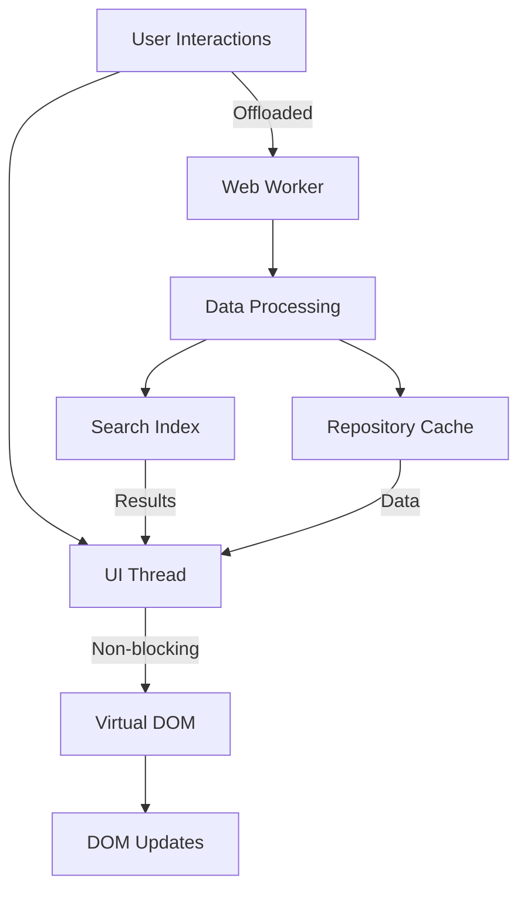
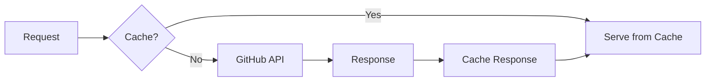

# Performance Optimization

Browsealizer is designed for performance, even when working with thousands of GitHub repositories. This document details our approach to optimization and tips for the best experience.

## Core Performance Strategies

### Client-Side Architecture

Browsealizer uses a carefully optimized client-side architecture:

Key features of this architecture:

1. **Web Workers**: Heavy computations run in separate threads
2. **Virtual DOM**: Minimizes expensive DOM operations
3. **Incremental Rendering**: Only visible elements are rendered
4. **Resource Prioritization**: Critical resources load first

### Efficient Data Management

Data is managed through a sophisticated caching system:

- **IndexedDB Storage**: Persistent local database for repository data
- **Memory Cache**: In-memory LRU cache for frequently accessed items
- **Partial Hydration**: Only necessary data is loaded from storage
- **Incremental Updates**: Changes are applied without full reloads

## Performance Metrics

Browsealizer targets these performance benchmarks:

| Metric | Target | Notes |
|--------|--------|-------|
| Initial load | < 2 seconds | On mid-range devices with good connection |
| Time to interactive | < 3.5 seconds | Core functionalities available |
| Scroll FPS | 60 | Smooth scrolling through infinite feed |
| Memory usage | < 100MB | For normal browsing sessions |
| Search latency | < 150ms | For most queries against 10,000+ repositories |

## Optimization Techniques

### Network Optimization

Browsealizer minimizes network requests through:

1. **Request Batching**: Multiple repository requests are combined
2. **Staggered Loading**: Critical content loads first, then enhances
3. **Prefetching**: Anticipates user navigation and loads data in advance
4. **Content Compression**: All transferred data is compressed
5. **Resource Caching**: Assets are cached using service workers

### Rendering Optimization

The rendering pipeline is highly optimized:

1. **Virtualized Lists**: Only visible items are rendered in the DOM
2. **Component Memoization**: Prevents unnecessary re-renders
3. **CSS Containment**: Reduces style recalculation scope
4. **Will-change Hints**: Prepares browser for animations
5. **Optimized Animations**: Uses GPU-accelerated properties

### Memory Management

To keep memory usage low even with thousands of repositories:

1. **Sparse Arrays**: Only store necessary repository data
2. **Object Pooling**: Reuse objects instead of creating new ones
3. **Incremental Garbage Collection**: Schedule GC during idle time
4. **Memory Monitoring**: Detect and respond to memory pressure
5. **Data Eviction**: Least recently used items are removed from memory

## Mobile Optimization

Special optimizations for mobile devices:

1. **Reduced Motion**: Simpler animations on low-power devices
2. **Image Optimization**: Images are sized appropriately for the screen
3. **Deferred Loading**: Non-critical content loads only when needed
4. **Touch Optimization**: Larger touch targets and gesture support
5. **Network-Aware Delivery**: Content quality adjusts to connection speed

## GitHub API Usage

Efficient GitHub API usage is critical:

1. **Rate Limit Management**: Dynamic rate limiting to avoid throttling
2. **GraphQL Queries**: Prefer GraphQL to get exactly what's needed
3. **Conditional Requests**: Use ETags to avoid unnecessary transfers
4. **Incremental Polling**: Update only changed data
5. **Authentication Benefits**: Authenticated requests have higher limits

## Frontend Optimization Tips

For the best experience when using Browsealizer:

### Browser Recommendations

Best performance with these browsers (in order):

1. Chrome/Edge (Chromium-based)
2. Firefox
3. Safari

### System Recommendations

For optimal performance with large repositories:

- **RAM**: 8GB or more recommended
- **CPU**: Modern multi-core processor
- **GPU**: Hardware acceleration support
- **Connection**: Stable internet connection

### User Settings

Adjust these settings for your hardware:

1. **Card Density**: Lower density for slower devices
2. **Animation Level**: Reduce for better performance
3. **Prefetch Depth**: Adjust based on your connection
4. **Cache Size**: Set according to your available storage
5. **Background Syncing**: Enable for faster browsing

## Performance Monitoring

Browsealizer includes built-in performance monitoring:

1. Go to "Settings" > "Advanced" > "Performance"
2. View metrics for your current session:
   - Memory usage
   - Rendering performance
   - API call efficiency
   - Cache hit rates
3. Enable detailed logging for troubleshooting

## Conclusion

Browsealizer's performance-first architecture ensures a smooth experience even with extensive repository browsing. The combination of efficient data management, optimized rendering, and sophisticated caching creates a responsive application that scales to your needs.

If you encounter performance issues, please:

1. Update to the latest version
2. Check your browser and system recommendations
3. Adjust the performance settings
4. Contact support with the performance logs