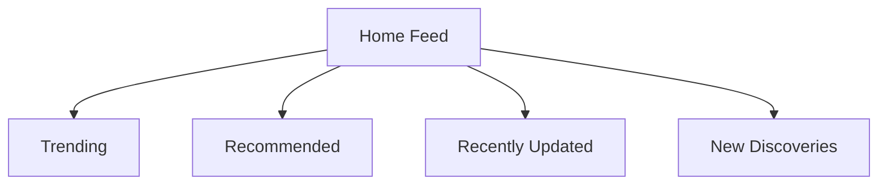

# User Guide

Browsealizer helps you discover and explore GitHub repositories in a seamless, enjoyable way. This guide covers all the major features and how to make the most of them.

## Getting Started

### Setting Up Your Profile

When you first launch Browsealizer, you'll be prompted to set up your profile:

1. Choose technology interests from the suggested categories or add your own
2. Set your experience level for more relevant suggestions
3. Connect your GitHub account (optional but recommended for enhanced features)
4. Choose a default view mode (card, list, or details)

### Home Feed

The home feed is your personalized repository discovery stream:



- **Trending**: Popular repositories across GitHub
- **Recommended**: Repositories matching your interests
- **Recently Updated**: Active repositories with recent commits
- **New Discoveries**: Repositories outside your typical interests

## Browsing Repositories

### Navigation

The main navigation appears on the left side of the interface:

- **Home**: Your personalized feed
- **Explore**: Browse categories and curated collections
- **Language**: Browse by programming language
- **Collections**: Your saved repository collections
- **History**: Recently viewed repositories
- **Settings**: Customize your experience

### Repository Cards

Each repository is displayed as an interactive card:

```
┌─────────────────────────────────────┐
│ repository-name                     │
│                                     │
│ A brief description of the          │
│ repository and its purpose          │
│                                     │
│ ★ 1,234   ⑂ 567   ⊕ Python, React   │
│                                     │
│ [Details]         [Add to Collection]│
└─────────────────────────────────────┘
```

- Click the card to see a quick preview
- Click "Details" to view the full repository page
- Star icon shows the number of GitHub stars
- Fork icon shows the number of forks
- Language tags show primary technologies

### Detail View

The repository detail view provides comprehensive information:

- **Overview**: README contents, tags, and key metrics
- **Activity**: Commit history, issue activity, and release timeline
- **Contributors**: Active contributors and their contributions
- **Analysis**: Code quality metrics and dependency information
- **Similar**: Related repositories you might be interested in

## Search Capabilities

### Basic Search

The search bar at the top supports several query types:

- Simple text search: `state management`
- Language filter: `language:rust web framework`
- Star count range: `stars:1000..5000`
- Creation date: `created:>2022-01-01`
- Combined filters: `language:typescript stars:>5000 hooks`

### Advanced Search

Click the advanced search button next to the search bar to access:

- Multiple language selection
- Topic selection
- Last updated range
- License type filter
- Repository size filter
- Owner type (user or organization)

### Search Syntax

For power users, Browsealizer supports a rich search syntax:

| Syntax | Example | Description |
|--------|---------|-------------|
| `language:` | `language:rust` | Filter by programming language |
| `stars:` | `stars:>1000` | Filter by star count |
| `created:` | `created:2022-01-01..2022-12-31` | Filter by creation date |
| `pushed:` | `pushed:>2023-06-01` | Filter by last update |
| `topic:` | `topic:machine-learning` | Filter by topic |
| `is:` | `is:archived` | Filter by repository status |
| `NOT` | `language:javascript NOT framework` | Exclude term |
| `OR` | `framework OR library` | Match either term |

## Collections

Collections allow you to organize repositories you find interesting.

### Creating Collections

1. Click "Collections" in the main navigation
2. Select "New Collection"
3. Provide a name and optional description
4. Choose visibility (private or public)
5. Set tags for better organization

### Adding to Collections

Add repositories to collections in several ways:

- Click the "Add to Collection" button on a repository card
- Drag and drop cards to collections in the sidebar
- Use the "Save to" button in the repository detail view
- Select multiple cards and use the bulk "Add to Collection" action

### Sharing Collections

Share your curated collections with others:

1. Open the collection you want to share
2. Click the "Share" button
3. Choose a sharing method:
   - Public link
   - Export as JSON
   - Export as Markdown list
   - Export as HTML list

## Customization

### View Preferences

Customize how repositories are displayed:

1. Go to "Settings" > "Display"
2. Choose your preferred view mode:
   - Card view: Compact grid of repository cards
   - List view: Detailed rows with more information
   - Magazine view: Rich layout with README previews
3. Adjust card density and information density

### Feed Customization

Tailor your discovery feed to your preferences:

1. Go to "Settings" > "Feed"
2. Adjust content mix percentages:
   - Trending repositories
   - New discoveries
   - Recently updated
   - From your interests
3. Set filtering rules to hide certain types of content

## Mobile Features

The mobile version includes specialized features:

- **Gesture Navigation**: Swipe left/right to browse repositories
- **Offline Mode**: Access saved repositories without internet
- **Reading Position**: Resume browsing from where you left off
- **Data Saver**: Reduced image quality and deferred loading
- **Night Mode**: Optimized for evening browsing

## Integration Features

### Browser Extensions

The browser extension adds features directly to GitHub:

- Related repository recommendations on repository pages
- Enhanced search capabilities on GitHub search pages
- Quick save button for adding to Browsealizer collections
- Highlight repositories you've saved or viewed

### IDE Integration

For developers using VSCode or JetBrains IDEs:

1. Install the Browsealizer extension from your IDE marketplace
2. Sign in to your Browsealizer account
3. Access your collections directly from your IDE
4. Open repositories in your IDE with one click