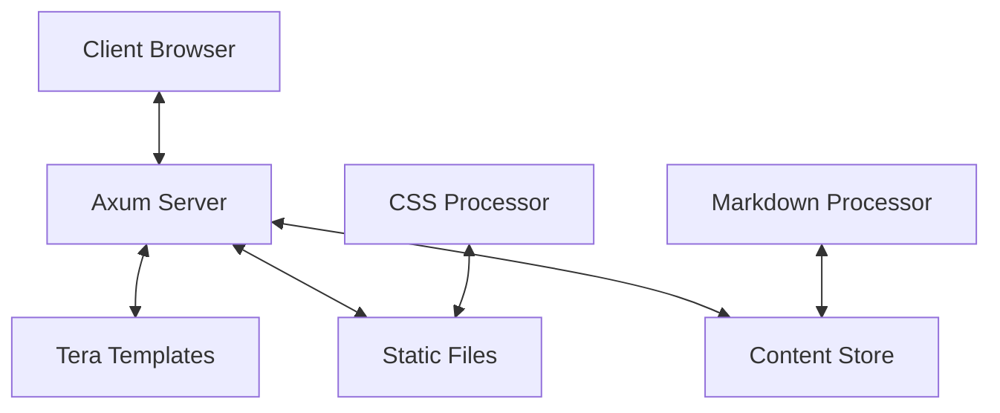

# Architecture

Cybrdelic Portfolio is built with a modern, performance-focused architecture designed to deliver a seamless, interactive user experience while maintaining excellent SEO and accessibility.

## System Overview



### Core Components

#### Axum Web Server

The application is powered by Axum, a modern Rust web framework:

- **Async Runtime**: Built on Tokio for high-performance, non-blocking I/O
- **Type-Safe Routing**: Compile-time route verification
- **Middleware Stack**: Logging, compression, and security enhancements
- **Error Handling**: Graceful error recovery and reporting

#### Tera Templating

The templating system uses Tera, a Jinja/Django-inspired template engine:

- **Component-Based Structure**: Modular templates with inheritance
- **Context Injection**: Dynamic data binding from Rust to templates
- **Filters and Macros**: Powerful transformation capabilities
- **Conditional Rendering**: Intelligent display logic

#### Content Management

Content is managed through a file-based system:

- **Markdown Processing**: Custom parser with extended syntax support
- **Project Metadata**: Structured data for projects and features
- **Content Organization**: Logical directory structure for maintainability
- **Static Content Generation**: Pre-processed at build time for performance

#### Front-End Architecture

The front-end is built with a modern, lightweight approach:

- **Vanilla JavaScript**: No heavy frameworks, just focused functionality
- **CSS Architecture**: Modular CSS with custom properties
- **Progressive Enhancement**: Core functionality works without JavaScript
- **Performance Optimization**: Asset minification and efficient loading

## Data Flow

1. Client makes a request to the Axum server
2. Router directs request to the appropriate handler
3. Handler queries the content store for needed data
4. Tera renders templates with the data context
5. Server responds with the rendered HTML
6. Client-side JavaScript enhances the experience

## Technical Implementation

### Server Components

The server-side code is organized into these main modules:

```
src/
├── handlers/         # Request handlers
├── markdown.rs       # Markdown processing
├── main.rs           # Application entry point
```

### Template Organization

Templates follow a hierarchical structure:

```
templates/
├── base.html         # Base template with common elements
├── components/       # Reusable UI components
│   ├── animated_icons/ # Project-specific animations
│   └── ...
├── index.html        # Home page template
├── project_detail.html # Project detail page
└── sections/         # Page sections
    ├── hero.html
    ├── projects.html
    └── ...
```

### Static Assets

Static assets are organized by type:

```
static/
├── css/              # Stylesheets
│   ├── components/   # Component-specific styles
│   ├── base/         # Base styles
│   └── ...
├── js/               # JavaScript files
└── images/           # Image assets
```

## Performance Optimizations

The application includes several performance optimizations:

- **Lazy Loading**: Images and heavy content load only when needed
- **Code Splitting**: JavaScript is modularized for efficient loading
- **CSS Optimization**: Minimal CSS with targeted loading strategies
- **Caching Strategy**: Appropriate cache headers for static content
- **Progressive Rendering**: Critical path rendering for fast initial load

## Deployment Architecture

The application is deployed with a streamlined approach:

- **Docker Containerization**: Consistent environment across deployments
- **Static File Serving**: Efficient delivery of immutable assets
- **CDN Integration**: Geographic distribution for low latency
- **HTTPS Everywhere**: Secure connections for all traffic