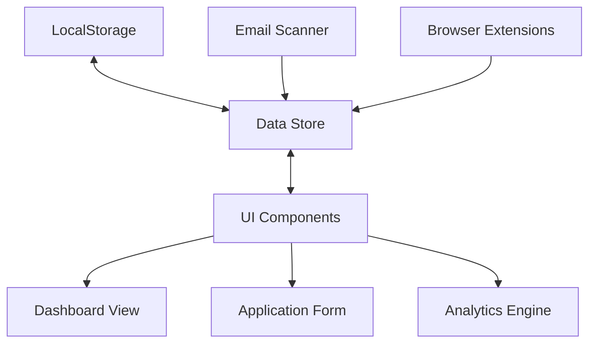

# Architecture

JJugg is built with a client-side architecture that prioritizes user privacy while providing powerful job application tracking functionality. The entire application runs in the browser, using localStorage for data persistence.

## Core Components

### Data Store

The data store serves as the central hub for all application data. It uses a custom-built state management system with the following features:

- **Real-time updates**: Changes to the data store immediately propagate to all UI components
- **Data validation**: Ensures data consistency across the application
- **Indexing**: Optimized queries for fast filtering and searching
- **Backup system**: Automatic data exports to prevent data loss

### UI Components

JJugg's UI is built with a component-based architecture that ensures consistency and reusability across the application. Key features include:

- **Responsive design**: Adapts seamlessly to different screen sizes
- **Accessibility**: WCAG 2.1 AA compliant
- **Theming**: Support for light, dark, and custom themes
- **Customizable layouts**: User-configurable dashboard views

### Browser Extensions

Optional browser extensions enhance JJugg's capabilities by:

- **Auto-detecting job applications**: Recognizes when you're on a job application page
- **Form auto-fill**: Populates job application forms from your profile data
- **Application status tracking**: Updates application status based on confirmation emails

## Data Flow

1. User creates or imports job application data
2. Data is stored locally in the browser's localStorage
3. Dashboard and analytics components process the data to generate insights
4. Email scanner periodically checks for status updates
5. UI components update in real-time as data changes

## Security Considerations

- All data remains on the user's local device
- No server backend means no risk of data breaches
- Optional encrypted backups for sensitive information
- Data can be exported and deleted at any time