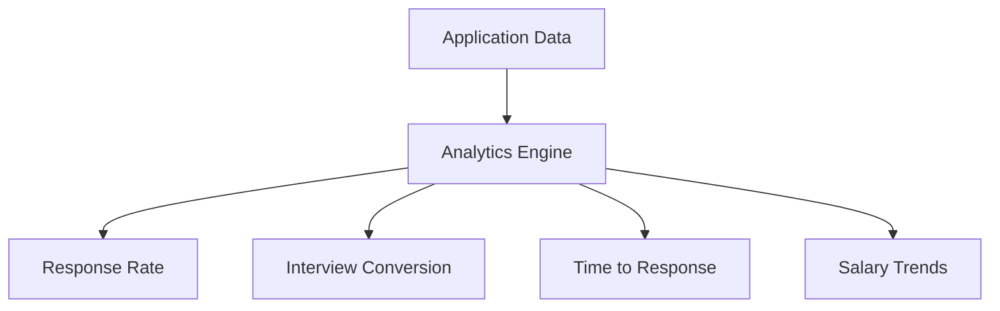

# Key Features

JJugg offers a comprehensive set of features to streamline your job application process and improve your chances of landing the perfect job.

## Application Tracking

The core of JJugg is its powerful application tracking system:

- **Kanban Board**: Visualize your application pipeline with customizable stages
- **Status Timeline**: Track the progression of each application over time
- **Smart Reminders**: Get notified when to follow up on applications
- **Bulk Actions**: Update multiple applications at once
- **Custom Fields**: Add your own tracking parameters

## Analytics Dashboard

Gain insights into your job search with detailed analytics:

- **Success Metrics**: Visualize your response and interview rates
- **Timeframe Analysis**: Track how long each stage of the process takes
- **Salary Comparison**: Compare offered compensation packages
- **Heatmap Calendar**: See your most active application periods
- **Custom Reports**: Generate reports for specific job types or companies

## Email Integration

JJugg automatically scans your inbox for job-related emails:

- **Status Updates**: Automatically detect interview invites, rejections, and offers
- **Email Templates**: Quick-access templates for common responses
- **Follow-up Tracking**: Monitor when you've followed up and when to do so again
- **Calendar Integration**: Add interviews directly to your calendar

## Resume Management

Manage multiple versions of your application materials:

- **Version Control**: Track changes to your resume over time
- **Tailoring Assistant**: Get suggestions for customizing your resume to specific job postings
- **ATS Compatibility Check**: Ensure your resume works with Applicant Tracking Systems
- **Format Conversion**: Export to PDF, DOCX, or plain text formats

## Privacy & Security

JJugg is designed with your privacy in mind:

- **100% Client-side**: Your data never leaves your device
- **No Tracking**: We don't collect usage data or analytics
- **Encrypted Backup**: Optional encrypted cloud backup
- **Data Export**: Export your data at any time in multiple formats