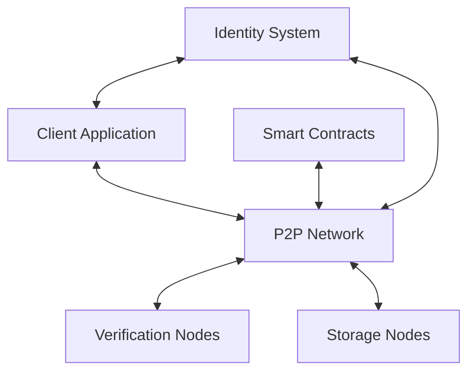

# Architecture

Lester is designed as a decentralized, trustless bounty system built on modern cryptographic principles and peer-to-peer technology. This document outlines the architectural design and components that make Lester a revolutionary approach to software development outsourcing.

## System Overview

### Key Components

#### Client Application

The client application serves as the user interface for bounty creators and claimers. Built with Textual for a terminal-based experience, it includes:

- **Bounty Management**: Create, browse, and claim bounties
- **Project Management**: Track progress and manage bounty submissions
- **Reputation Dashboard**: View and manage your reputation scores
- **Verification Interface**: Submit and review verification proofs
- **Wallet Integration**: Manage deposits and withdrawals

#### Peer-to-Peer Network

The P2P network is the foundation of Lester's decentralized architecture:

- **Distributed Hash Table (DHT)**: Enables efficient node discovery and content routing
- **Gossip Protocol**: Propagates network updates and new bounties
- **NAT Traversal**: Ensures connectivity across different network environments
- **Message Authentication**: Verifies the source of all network messages
- **Flood Protection**: Prevents network spam and DOS attacks

#### Verification Nodes

Verification nodes evaluate bounty submissions to ensure quality:

- **Language-Agnostic Verifiers**: Support for multiple programming languages
- **Test Execution Environment**: Sandboxed environments for running submission tests
- **Consensus Algorithm**: Multi-node agreement on verification results
- **Incentive System**: Rewards for honest verification participation
- **Challenge Mechanism**: Process for contesting verification results

#### Storage Nodes

Storage nodes maintain the distributed ledger of bounties and submissions:

- **Content-Addressable Storage**: Immutable references to bounty data
- **Replication Strategy**: Ensures data availability without central servers
- **Garbage Collection**: Manages storage space efficiently
- **Retrieval Market**: Incentivizes long-term data storage
- **History Compaction**: Reduces storage requirements while preserving history

#### Smart Contracts

Smart contracts enforce the rules of the bounty system:

- **Bounty Contract**: Defines requirements and payment terms
- **Escrow System**: Securely holds funds during the bounty lifecycle
- **Dispute Resolution**: Automated and human-mediated resolution processes
- **Reputation Contract**: Calculates and stores participant reputation
- **Governance Contract**: Enables community-driven protocol updates

#### Identity System

The identity system provides Sybil-resistant identities without sacrificing privacy:

- **Self-Sovereign Identity**: Users control their own identity data
- **Reputation Portability**: Reputation follows users across projects
- **Zero-Knowledge Proofs**: Verify claims without revealing sensitive information
- **Selective Disclosure**: Share only necessary identity attributes
- **Recovery Mechanism**: Restore identity after key loss

## Technical Implementation

Lester leverages several key technologies:

- **Rust Core**: Performance-critical components written in Rust
- **Python UI**: Terminal interface built with Textual
- **libp2p**: Foundation for peer-to-peer networking
- **Merkle-CRDTs**: Conflict-free data structures for distributed state
- **WASM Sandbox**: Secure execution environment for verifications
- **SQLite**: Local data storage with encryption

## Security Model

Lester's security is based on several core principles:

1. **Trust Minimization**: No single party needs to be trusted
2. **Economic Security**: Attacks are more expensive than potential gains
3. **Defense in Depth**: Multiple security layers protect against different threats
4. **Open Design**: Security through transparency and peer review
5. **Fault Isolation**: Problems in one component don't compromise the entire system