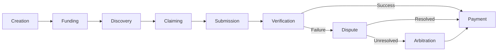

# Bounty Lifecycle

This document outlines the complete lifecycle of a bounty in the Lester system, from creation to completion.

## Overview



## Detailed Stages

### 1. Bounty Creation

The lifecycle begins when a bounty creator defines a new task:

```
lester bounty create
```

During creation, the bounty creator specifies:

- **Title**: A concise description of the task
- **Description**: Detailed requirements and acceptance criteria
- **Reward Amount**: The payment offered for completion
- **Timeline**: Deadline for submission
- **Skills Required**: Programming languages or frameworks needed
- **Verification Method**: How submissions will be evaluated
- **Dependencies**: Any required libraries or environments

The system generates a unique bounty ID and cryptographic proof of creation.

### 2. Bounty Funding

The bounty must be funded to become active:

```
lester bounty fund <bounty-id> --amount <value>
```

- Funds are transferred to an escrow account
- The escrow is controlled by a smart contract
- Funds remain locked until submission is verified or bounty is canceled
- Additional funding can be added to increase the reward

Once funded, the bounty becomes visible in the global marketplace.

### 3. Bounty Discovery

Potential bounty hunters discover available tasks:

```
lester bounty search --tags rust,crypto
```

- Browse through categorized listings
- Search by skill requirements
- Filter by reward amount
- Sort by deadline or creation date
- View creator reputation and past bounties

Hunters can ask clarifying questions which are recorded publicly on the bounty record.

### 4. Bounty Claiming

A bounty hunter claims a task to signal their intent:

```
lester bounty claim <bounty-id>
```

- Claiming is non-exclusive (multiple people can work on a bounty)
- Claiming creates a cryptographic association between hunter and bounty
- First successful submission receives the reward
- Claim expiration ensures bounties aren't blocked indefinitely

The system notifies the bounty creator when claims are made.

### 5. Work Submission

When the work is complete, the hunter submits their solution:

```
lester bounty submit <bounty-id> --path ./solution
```

- Submission is cryptographically signed by the hunter
- Files are packaged and distributed to verification nodes
- Submission timestamp is recorded on the distributed ledger
- Hunter can update their submission until the deadline

The system notifies all parties and begins the verification process.

### 6. Verification Process

Verification nodes evaluate the submission against requirements:

```
# Automated verification
lester verify <submission-id>

# Manual verification
lester verify <submission-id> --manual
```

- For code: automated tests execute in sandboxed environments
- For design: specified reviewers evaluate against criteria
- Multiple nodes independently verify to ensure fairness
- Results are aggregated to prevent single-node manipulation

Verification produces detailed logs and evidence of correctness.

### 7. Payment Distribution

Upon successful verification, payment occurs automatically:

```
# Payment happens automatically but can be tracked
lester bounty status <bounty-id>
```

- Escrow releases funds to the successful hunter
- Transaction is recorded on the distributed ledger
- System fees are deducted (typically 2-5%)
- Reputation scores update for all parties

A cryptographic receipt provides proof of payment.

### 8. Dispute Resolution

If verification fails or is contested, a dispute can be raised:

```
lester dispute create <submission-id> --reason "Tests inconsistent with requirements"
```

- Initial resolution attempts use automated conflict detection
- If unresolved, designated community arbiters review evidence
- Time-locked resolution ensures disputes don't stall indefinitely
- Both parties can submit additional evidence

The dispute outcome is recorded with justification for future reference.

### 9. Bounty Closure

After successful completion or timeout, the bounty closes:

```
# Automatic on successful payment
# Manual for unresolved bounties
lester bounty close <bounty-id> --reason "Requirements changed"
```

- Final state is recorded on the distributed ledger
- All participants receive completion notifications
- Bounty becomes searchable as a historical record
- Solution becomes available according to specified license