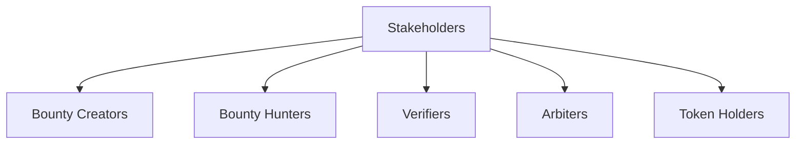
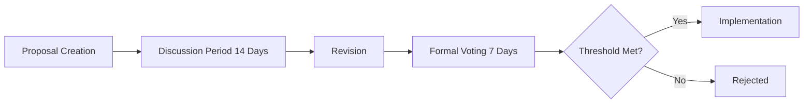
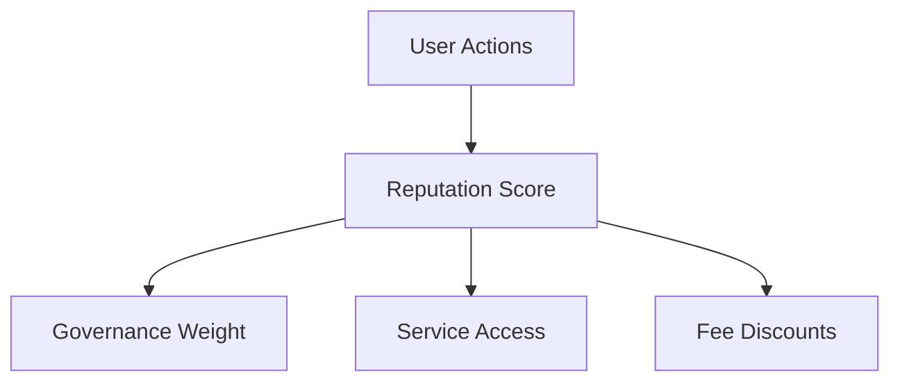

# Governance Model

Lester uses a decentralized governance model that enables community members to participate in decision-making while ensuring the system's integrity and stability.

## Governance Philosophy

The Lester governance system is guided by these core principles:

1. **Decentralization**: No single entity controls the network
2. **Meritocracy**: Influence is earned through positive contributions
3. **Transparency**: All governance actions are publicly visible
4. **Inclusivity**: All stakeholders can participate
5. **Security**: Governance cannot compromise system security

## Stakeholder Classes

Lester recognizes several stakeholder classes, each with different rights and responsibilities:

### Bounty Creators

Users who create and fund bounties:
- Can create and manage bounties
- Vote on changes affecting bounty creation and funding
- Stake their reputation on bounty quality

### Bounty Hunters

Users who claim and complete bounties:
- Submit solutions to bounties
- Vote on changes affecting submission and verification
- Stake their reputation on submission quality

### Verifiers

Specialized nodes that validate submissions:
- Run verification tests on submissions
- Vote on changes to verification protocols
- Stake tokens on verification accuracy

### Arbiters

Trusted community members who resolve disputes:
- Review contested verifications
- Make binding decisions on disputes
- Stake significant tokens on decision accuracy

### Token Holders

Users who hold Lester governance tokens:
- Vote on protocol upgrades
- Elect arbiters
- Vote on treasury allocations

## Decision-Making Process

Lester's governance uses several decision mechanisms depending on the scope and impact of the decision:

### 1. Improvement Proposals

For significant protocol changes:

1. **Proposal Submission**: Any stakeholder can submit an improvement proposal
2. **Discussion Period**: Community discusses and suggests improvements
3. **Revision**: Proposer may revise based on feedback
4. **Formal Voting**: Token-weighted voting occurs
5. **Implementation**: If approved, changes are implemented

Different proposal types have different voting thresholds:

| Proposal Type | Required Majority | Minimum Participation |
|---------------|-------------------|------------------------|
| Core Protocol | 67% | 40% of tokens |
| Economic Parameters | 60% | 30% of tokens |
| UI/UX Features | 51% | 20% of tokens |
| Documentation | 51% | 10% of tokens |

### 2. Emergency Governance

For time-sensitive security issues:

1. **Alert**: Security committee identifies critical issue
2. **Quick Proposal**: Expedited proposal with 24-hour voting
3. **Implementation**: Requires 75% approval with minimum 25% participation
4. **Post-Review**: Standard governance review follows implementation

### 3. Continuous Parameters

Some parameters are adjusted through automated feedback:

- Verification fees
- Dispute resolution timelines
- Network resource allocation

These parameters adjust based on network conditions and usage patterns.

## Reputation System

The reputation system is a key component of governance:

Reputation is earned through:

- Successfully completed bounties
- Accurate verifications
- Contributions to the codebase
- Participation in governance
- Fair dispute resolution

Reputation is lost through:

- Failed bounty deliveries
- Inaccurate verifications
- Malicious behavior
- Abandoned commitments

## Treasury Management

The Lester treasury holds funds for network operation and development:

### Funding Sources

1. **Protocol Fees**: Small percentage of bounty transactions
2. **Verification Fees**: Paid by bounty creators for verification services
3. **Dispute Resolution Fees**: Paid by the losing party in disputes
4. **Grants and Donations**: External funding sources

### Allocation Process

Treasury funds are allocated through:

1. **Regular Budget Proposals**: Quarterly budget allocation
2. **Grant Programs**: Funding for ecosystem development
3. **Operational Expenses**: Ongoing infrastructure costs
4. **Emergency Fund**: Reserved for critical issues

## Governance Implementation

The technical implementation of governance uses a multi-layer approach:

### On-Chain Governance

Core protocol decisions occur on-chain:
- Token-weighted voting
- Automatic execution of approved changes
- Immutable record of decisions

### Off-Chain Governance

Discussion and coordination happen off-chain:
- Forums for proposal discussion
- Working groups for specific domains
- Documentation and specification development

### Hybrid Solutions

Some decisions use a hybrid approach:
- Off-chain discussion and consensus building
- On-chain final voting and execution

## Governance Evolution

The governance system itself evolves through:

1. **Meta-Proposals**: Proposals about changing the governance process
2. **Periodic Reviews**: Regular assessments of governance effectiveness
3. **Gradual Decentralization**: Progressive shift toward greater community control
4. **Benchmark Analysis**: Comparing governance outcomes against objectives

## Safeguards and Checks

To prevent governance attacks and misuse:

- **Time Locks**: Delay between approval and implementation
- **Gradual Parameter Changes**: Limits on how quickly parameters can change
- **Judicial Committee**: Last-resort human oversight for contentious decisions
- **Forking Mechanism**: Community can fork if governance fails

## Participation Guidelines

To participate effectively in governance:

### For New Participants

1. Start by joining discussion forums
2. Read historical proposals and decisions
3. Participate in non-binding polls
4. Build reputation before making major proposals

### For Active Participants

1. Focus on specific domains matching your expertise
2. Join working groups for detailed discussion
3. Help newer participants understand the system
4. Consider long-term sustainability in all proposals

## Future Governance Roadmap

The governance system will evolve through these planned phases:

| Phase | Timeline | Key Changes |
|-------|----------|-------------|
| Genesis | Current | Core team has significant influence |
| Community | Q3 2023 | Token holder voting begins |
| Federation | Q1 2024 | Delegation and representative systems |
| Maturity | Q4 2024 | Fully decentralized autonomous governance |

Each phase gradually reduces central influence and increases community control.