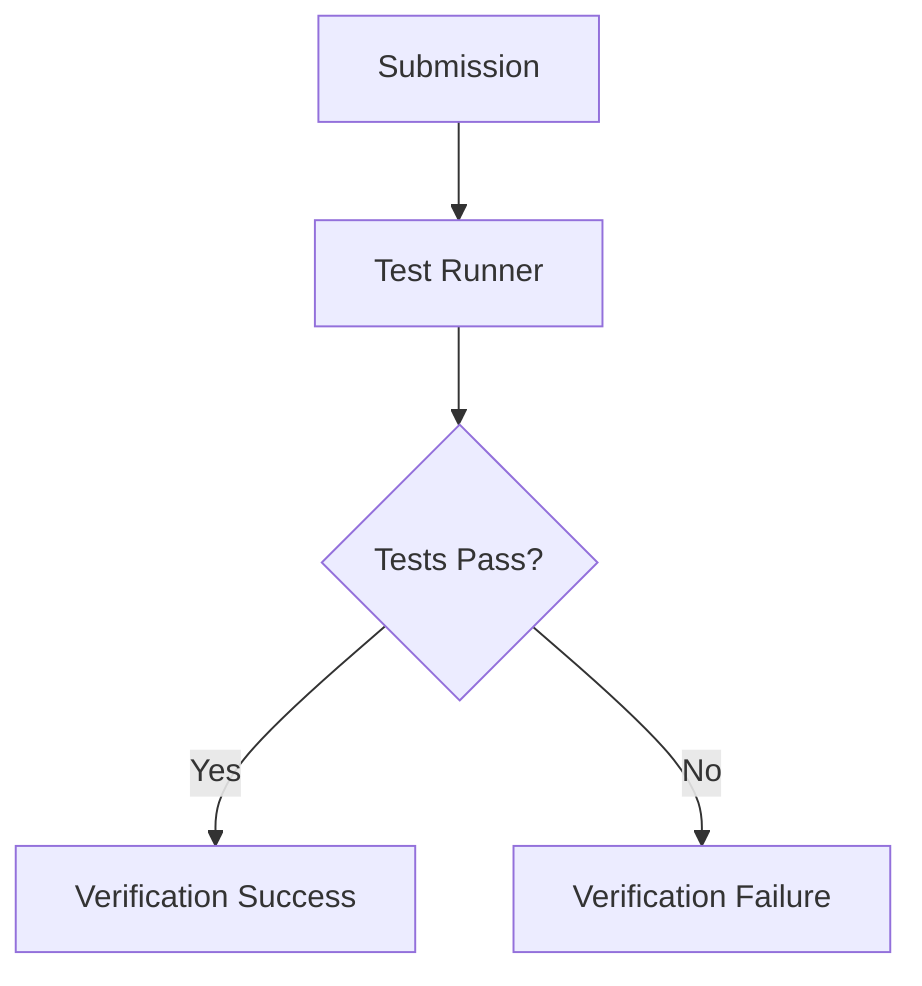

# Verification System

Lester's verification system is its most innovative component, enabling trustless validation of development work across multiple programming languages and project types.

## Verification Principles

The verification system follows four core principles:

1. **Objectivity**: Verification must produce the same result regardless of who performs it
2. **Determinism**: Given the same inputs, verification always produces the same outputs
3. **Transparency**: The verification process must be fully auditable
4. **Independence**: Verifiers must be unable to collude or manipulate results

## Verification Methods

Lester supports multiple verification approaches:

### Automated Testing

The primary verification method uses automated tests:



- **Test Suites**: Bounty creators define tests that solutions must pass
- **Dockerized Execution**: Tests run in isolated containers
- **Multi-language Support**: Supports all major programming languages
- **Resource Limits**: Prevents infinite loops or resource exhaustion
- **Reproducible Builds**: Ensures consistent environment for all verifications

### Specification Compliance

For projects with formal specifications:

```
lester verify <submission-id> --spec ./formal-spec.json
```

- **Formal Verification**: Mathematical proof of correctness against specifications
- **Property-Based Testing**: Generates test cases from property definitions
- **Invariant Checking**: Ensures code maintains required invariants
- **Static Analysis**: Identifies potential issues without execution
- **Type Checking**: Verifies type safety across the codebase

### Performance Benchmarking

For performance-critical tasks:

```
lester verify <submission-id> --benchmark ./benchmark-suite
```

- **Comparative Benchmarking**: Tests against reference implementation
- **Resource Profiling**: Measures CPU, memory, and I/O usage
- **Scalability Testing**: Validates behavior under increasing load
- **Consistent Environment**: Ensures fair comparison across submissions
- **Statistical Validation**: Accounts for execution variability

### Human Review

For tasks requiring subjective evaluation:

```
lester verify <submission-id> --reviewers 5 --rubric ./design-rubric.json
```

- **Blind Review**: Reviewers don't know the submitter's identity
- **Consensus Mechanism**: Requires agreement among multiple reviewers
- **Structured Rubrics**: Clear criteria for evaluation
- **Evidence Requirements**: Reviewers must justify their assessments
- **Stake-Based Selection**: Reviewers stake tokens on honest reviews

## The Verification Node Network

Verification is performed by a network of specialized nodes:

- **Node Diversity**: Geographically and jurisdictionally distributed
- **Stake Requirement**: Nodes stake tokens to participate
- **Random Assignment**: Bounties are randomly assigned to prevent gaming
- **Consensus Requirement**: Multiple nodes must agree on verification results
- **Reputation System**: Nodes build reputation through accurate verifications

## Challenges and Disputes

Lester includes a robust challenge system for disputed verifications:

1. **Initial Challenge**: Participant challenges a verification result
2. **Evidence Submission**: Both parties submit supporting evidence
3. **Expanded Verification**: Additional nodes review the submission
4. **Stake-Based Voting**: Community members stake tokens on the outcome
5. **Resolution**: Final determination based on supermajority

## Security Considerations

The verification system incorporates several security measures:

- **Time-Locked Verification**: Results are committed before being revealed
- **Sybil Resistance**: Multiple identity verification techniques
- **Incentive Alignment**: Rewards for honest verification
- **Penalties**: Slashing for dishonest behavior
- **Sandboxing**: Security isolation for executing untrusted code

## Technical Implementation

Our verification system is built on:

- **WASM Sandbox**: WebAssembly for cross-language verification
- **Docker Containers**: Isolated execution environments
- **Formal Methods**: Z3 theorem prover for specification verification
- **Zero-Knowledge Proofs**: Privacy-preserving verification for sensitive code
- **Content-Addressed Storage**: Immutable record of verification artifacts