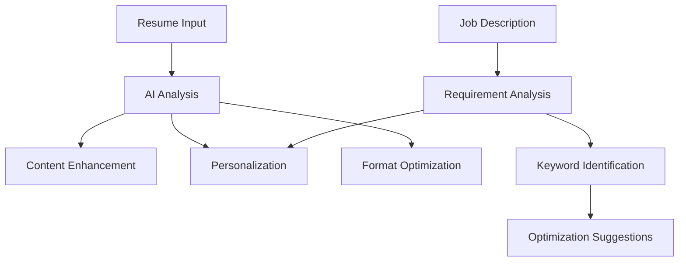

# AI Integration

Resumatyk leverages AI technology throughout the resume creation process to deliver a smart, adaptive experience that produces professional results. This document explains how AI is integrated into the platform.

## AI Capabilities Overview



## Content Analysis

### Resume Parsing

When a user uploads an existing resume, our AI:

1. **Structure Recognition**: Identifies sections (experience, education, skills)
2. **Entity Extraction**: Identifies companies, roles, dates, and technologies
3. **Sentiment Analysis**: Evaluates tone and impact of achievement statements
4. **Grammar & Style Check**: Identifies potential language improvements

### Job Description Analysis

For targeted resume creation:

1. **Requirement Extraction**: Identifies must-have and nice-to-have requirements
2. **Keyword Identification**: Extracts industry-specific and role-specific terms
3. **Cultural Indicators**: Identifies company values and culture markers
4. **Priority Assessment**: Ranks requirements by importance and frequency

## Content Generation

### Achievement Enhancement

AI improves the impact of achievement statements:

```
Original: "Managed a team that built a new customer portal"

AI Enhanced: "Led cross-functional team of 8 developers to deliver customer 
portal that increased user engagement by 27% and reduced support tickets by 35%"
```

Key enhancements include:

1. **Quantification**: Adding metrics and numbers
2. **Action Verbs**: Using stronger, more specific verbs
3. **Outcome Focus**: Emphasizing results, not just activities
4. **Specificity**: Adding concrete details and context

### Skill Gap Analysis

The AI identifies potential skills gaps between your experience and job requirements:

1. **Gap Detection**: Comparing your skills against job requirements
2. **Suggestion Generation**: Recommending ways to address or reframe gaps
3. **Alternative Phrasing**: Finding equivalent skills you may have
4. **Prioritization**: Focusing on the most critical missing elements

## Personalization Engine

### Tailoring Algorithm

The AI tailors your resume to specific positions through:

1. **Priority Reordering**: Presenting most relevant experience first
2. **Emphasis Adjustment**: Highlighting skills matching the job description
3. **Terminology Alignment**: Using industry-specific language from the posting
4. **Experience Framing**: Contextualizing past roles for the target position

### Learning System

The AI improves over time through:

1. **Feedback Loop**: Learning from user acceptance/rejection of suggestions
2. **Success Tracking**: Analyzing which resumes lead to interviews
3. **Industry Trends**: Staying current with changing terminology and skills
4. **A/B Testing**: Comparing different approaches for similar positions

## Technical Implementation

### AI Models

Resumatyk uses multiple specialized models:

| Model | Purpose | Technology |
|-------|---------|------------|
| Document Parser | Resume structure analysis | Transformer-based NER |
| Content Enhancer | Improving achievement statements | Fine-tuned GPT model |
| Keyword Extractor | Identifying important terms | Domain-specific BERT |
| Formatter | Layout optimization | Rule-based system with ML components |
| Recommender | Suggesting improvements | Hybrid collaborative filtering |

### Training Data

Our models are trained on diverse datasets:

1. **Resume Corpus**: Thousands of anonymized professional resumes
2. **Job Postings**: Millions of job descriptions across industries
3. **Recruiter Feedback**: Input from HR professionals and recruiters
4. **Success Patterns**: Resumes with confirmed interview outcomes

## Using AI Features

### Manual vs. Automatic

Users can choose their AI assistance level:

- **Full Automation**: AI handles entire tailoring process
- **Suggestion Mode**: AI offers changes for user approval
- **Manual with Tips**: User maintains full control with AI suggestions
- **Off**: No AI assistance

### Specific AI Tools

#### Smart Bullet Points

Transforms basic job descriptions into compelling achievements:

```
Input: "Responsible for customer service and handling complaints"

Output: "Delivered exceptional customer service with 98% satisfaction rate, 
resolving complex complaints and reducing escalation rate by 23%"
```

Usage:
1. Enter basic job description
2. Click "Enhance" button
3. Select preferred version or request alternatives

#### Skill Matcher

Aligns your skills with job requirements:

1. Upload job description
2. AI highlights skills matches and gaps
3. System suggests phrasing to emphasize matching skills
4. Recommends addressing critical skill gaps

#### Summary Generator

Creates professional summaries tailored to target positions:

1. Select target job type
2. Choose desired tone (formal, confident, etc.)
3. AI generates 3-5 summary options
4. Edit or accept preferred version

## Ethical Considerations

We implement several safeguards around our AI system:

### Accuracy & Honesty

- AI will not fabricate experience or credentials
- All suggestions maintain factual accuracy
- System encourages honest representation

### Privacy

- All uploaded documents are processed with strict privacy controls
- User data is not used to train models without explicit consent
- Personal identifiers are removed from any training data

### Bias Mitigation

- Models are regularly audited for bias in suggestions
- Diverse training data helps ensure fairness
- Users can report potentially biased suggestions

## Future AI Developments

Upcoming AI features include:

1. **Visual Design AI**: Suggest layout improvements based on position type
2. **Interview Prep**: Generate likely interview questions based on resume
3. **Career Path AI**: Suggest skills to develop for desired career progression
4. **Industry-Specific Models**: Specialized models for fields like tech, finance, healthcare

## Feedback System

Help improve our AI:

1. Rate suggestions with thumbs up/down
2. Provide specific feedback on AI-generated content
3. Report any issues with AI suggestions
4. Share success stories for system improvement