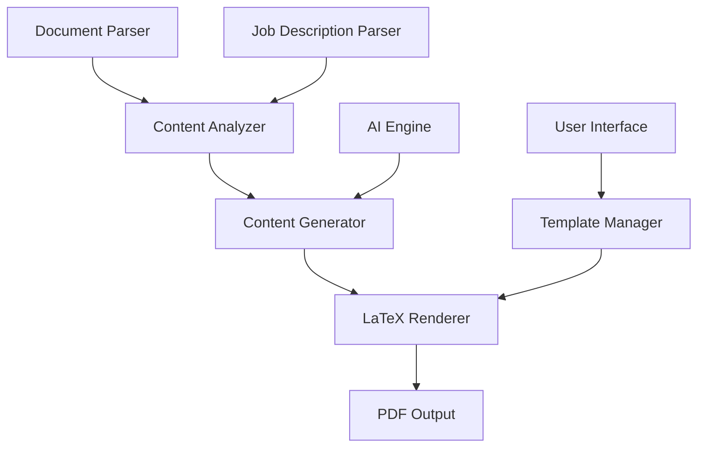

# Architecture

Resumatyk employs a modern, modular architecture designed for flexibility and extensibility. The system consists of several independent components that work together to generate tailored resumes.

## System Overview

### Core Components

#### Document Parser

The Document Parser is responsible for extracting structured data from existing resumes and CVs:

- **OCR Engine**: Converts scanned documents to text
- **Structure Analyzer**: Identifies sections and formats
- **Content Extractor**: Pulls out skills, experience, and education details
- **Metadata Handler**: Extracts dates, locations, and other metadata

#### Job Description Parser

This component analyzes job postings to identify key requirements:

- **Keyword Extractor**: Identifies important skills and qualifications
- **Responsibility Analyzer**: Determines primary job functions
- **Cultural Indicators**: Identifies company culture signals
- **Requirement Prioritizer**: Ranks requirements by importance

#### Content Generator

The AI-powered Content Generator tailors resume content to match job requirements:

- **Content Matcher**: Aligns your experience with job requirements
- **Skill Highlighter**: Emphasizes relevant skills
- **Achievement Reframer**: Contextualizes achievements for specific roles
- **Gap Analyzer**: Suggests additions for missing requirements

#### LaTeX Renderer

The LaTeX Renderer produces professionally formatted documents:

- **Template Engine**: Applies styling based on selected templates
- **Typography Module**: Ensures optimal font usage and spacing
- **Layout Manager**: Handles page breaks and section positioning
- **ATS Compatibility Layer**: Ensures compatibility with Applicant Tracking Systems

## Technical Implementation

Resumatyk is built using a combination of Python for backend processes and a modern web frontend:

- **Python Core**: Handles document processing and AI integration
- **React Frontend**: Provides an intuitive user interface
- **PostgreSQL Database**: Stores templates and user data
- **Redis Cache**: Improves performance for repeat operations
- **Docker Containers**: Ensures consistent deployment across environments

## Data Flow

1. User uploads their existing resume and a job description
2. Document Parser extracts structured data from the resume
3. Job Description Parser identifies key requirements
4. Content Generator creates tailored content with AI assistance
5. User selects a template and customizes formatting
6. LaTeX Renderer produces the final document
7. User downloads the professionally formatted PDF